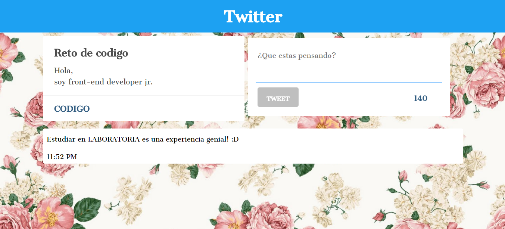

## **RETO DE CODIGO TWITTER**  
En el siguiente trabajo se realizó una replica de la red social Twitter.  

### Informacion General
- Tipografīa utilizada Sree Krushnadevaraya.
- El sitio esta estructurado con 3 secciones:  

 **HEADER** :En el se encuentra el titulo de la pagina el cual contiene un alineado al centro y su contenedor con un ancho de el 100%.  
 **SECCION UNO**:En la seccion uno se encuentra la zona de datos del usuario y el cuadro de texto el cual contiene un boton de envio de tweets.  
 **SECCION DOS**:En la seccion dos se encuentra el cuadro en el cual se verifican los posts realizados por el usuario.

### Herramientas  
Se utilizó:
- CSS  
- HTML  
- JAVASCRIPT  
